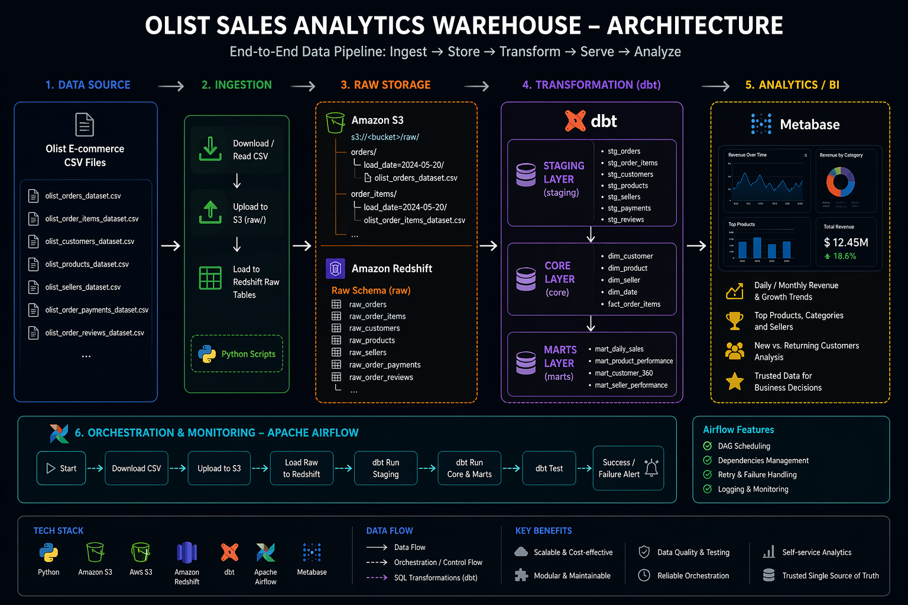
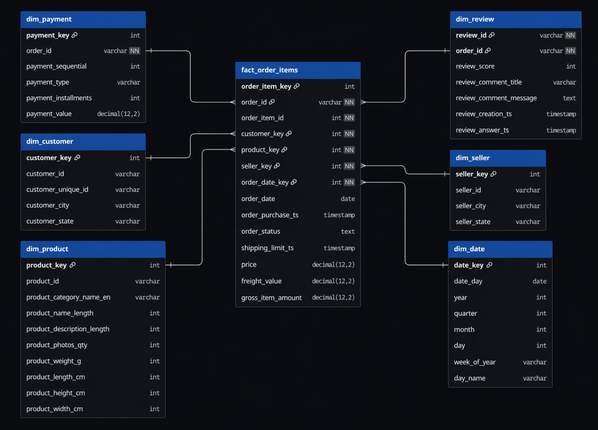
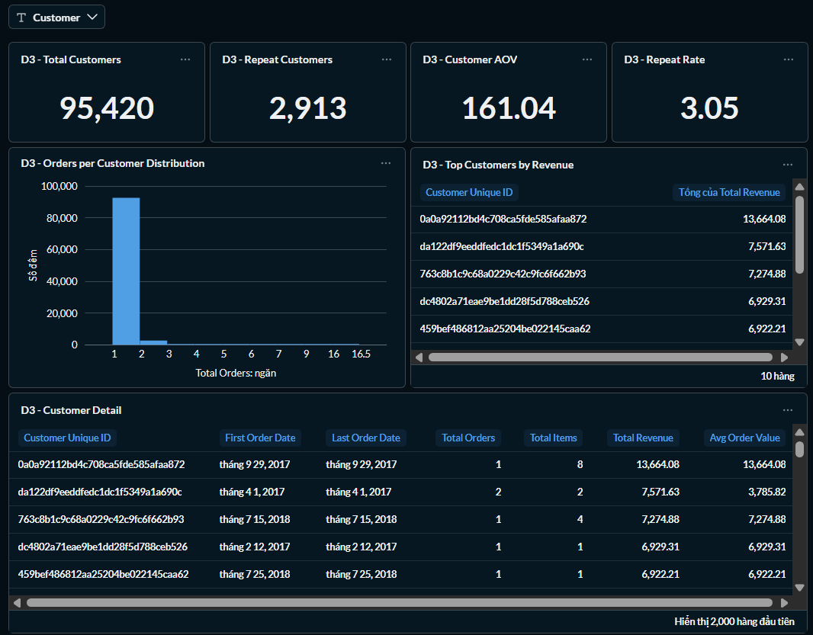
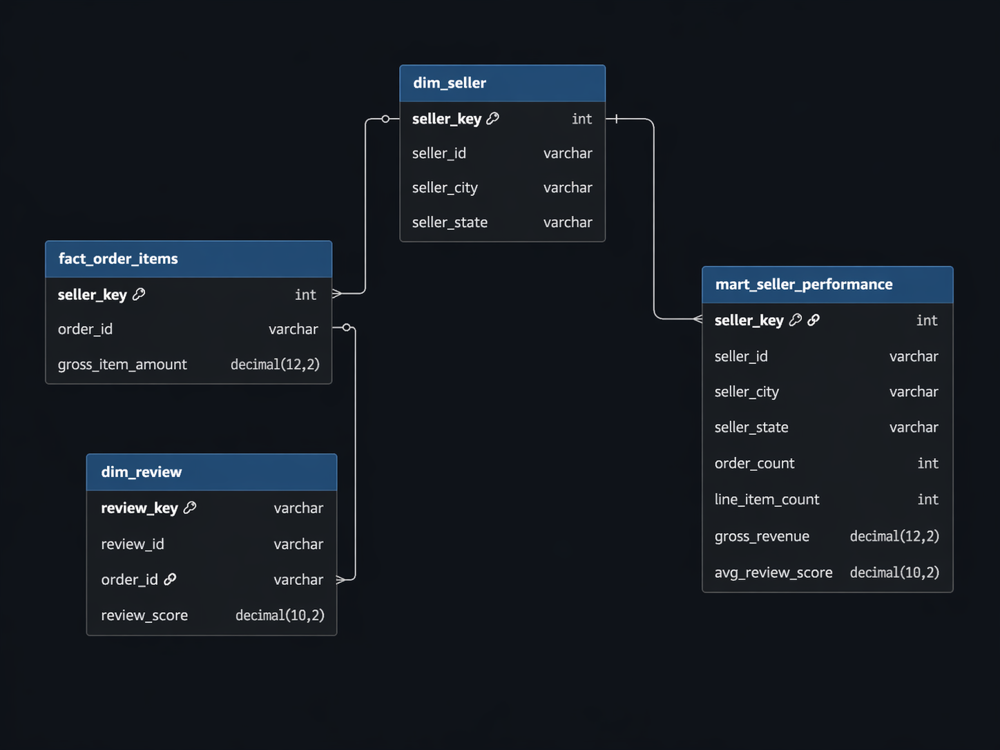
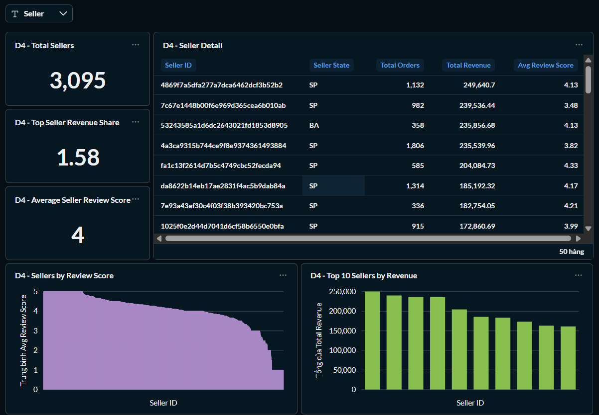

# 🏗️ Data Warehouse & Mart Build: Production ETL Pipeline

An end-to-end data engineering pipeline that transforms raw CSV files from Brazilian E-Commerce Public Dataset by Olist into a normalized star schema data warehouse, then builds analytical data marts.

---

## 🧾 Executive Summary (For Hiring Managers)

- ✅ **Pipeline scope:** Built an end-to-end e-commerce analytics pipeline from raw Olist CSV files to S3, Redshift, dbt models, and BI-ready marts.
- ✅ **Data modeling:** Designed a star-schema-style warehouse centered on `fact_order_items` with dimensions and marts for sales, products, customers, and sellers.
- ✅ **ELT development:** Implemented Python ingestion to read CSV files, upload them to Amazon S3, and load Redshift raw tables with `COPY`.
- ✅ **Transformation layer:** Structured dbt models across **staging → core → marts** for clean, reusable analytics modeling.
- ✅ **Orchestration & analytics:** Designed the pipeline to be orchestrated by Airflow and consumed by BI dashboards for revenue, product, seller, and customer analysis.

---

## 🧩 Problem & Context

The business needs a trusted analytics warehouse that can answer questions such as:

- revenue by day/month/quarter
- top products and categories
- seller performance
- new vs. returning customers
- service quality and delivery impact

**Challenge:** Raw operational CSVs into a warehouse that is consistent, reusable, and safe for BI. That means preserving raw data for replay, standardizing source tables, choosing the correct fact grain, separating dimensions from facts, and exposing marts that are easy for dashboards to query. In this project, the chosen analytical grain is 1 row per order item, because it supports accurate revenue calculation and natural analysis by product, category, seller, customer, and date.

**Solution:** CSV files → S3 raw → Redshift raw tables → dbt staging → dbt core → dbt marts → BI dashboard, orchestrated by Airflow. This architecture creates a trusted source of truth for analytics and supports portfolio-ready dashboards such as Daily Sales Overview, Product / Category Performance, and Customer / Seller Overview.

---

## 🧰 Tech Stack

- ☁️ **Storage:** Amazon S3 for raw CSV landing and replayable raw file storage.
- 🐍 **Language:** Python for ingestion, S3 upload, Redshift raw loading, configuration, and logging.
- ⚡ **Transformation:** dbt for building analytics models across **staging → core → marts**.
- 🏛️ **Warehouse / Serving:** Amazon Redshift for raw-layer loading and analytics-ready warehouse tables.
- 🐳 **Development Environment:** Docker / Docker Compose for local development and service orchestration. 
- 📊 **Dashboarding:** Metabase for business dashboards on revenue, products, sellers, and customers.
- 🔄 **Orchestration:** Apache Airflow for scheduling, dependency management, retries, and pipeline monitoring.  
- 📦 **Version Control:** Git / GitHub for source control and portfolio publishing. 

---

## 🏗️ Pipeline Architecture

The pipeline transforms job posting CSVs from Brazilian E-Commerce Public Dataset by Olist into a normalized star schema data warehouse, then builds specialized analytical data marts. BI tools (Metabase, Power BI, Tableau, Python) consume from both the warehouse and marts.

### Data Warehouse

The data warehouse implements a star schema with `dim_customer`, `dim_product`, `dim_date`, `dim_seller`, `dim_review`, `dim_payment`, and `fact_order_items` tables.

- **Core schema:** A star-schema-style warehouse centered on **`fact_order_items`** with supporting dimensions for customer, product, seller, payment, review, and date analysis.
- **Purpose:** Provide a trusted analytical layer for revenue, product/category performance, seller performance, customer behavior, and service quality reporting.
- **Grain:** 1 row per order item** in the fact table (`fact_order_items`).
- **Modeling note:** Payment and review data originate at order level, so they must be joined carefully when used alongside line-item facts.

### Mart Daily Sales

Daily sales summary for revenue and order trends.

- **Mart schema:** `mart_daily_sales`
- **Purpose:** Trend analysis for daily revenue and order volume.
- **Grain:** **1 row per day**
- **Key Features:** Revenue trend, order count trend, daily KPI reporting.

### Mart Product Performance

Product and category analytics mart.

- **Mart schema:** `mart_product_performance`
- **Purpose:** Identify top products and top categories by business performance.
- **Grain:** **1 row per product / category / analysis date grain**
- **Key Features:** Product ranking, category ranking, revenue contribution.

### Mart Customer 360

Customer behavior analytics mart.

- **Mart schema:** `mart_customer_360`
- **Purpose:** Analyze repeat customers, AOV, and recency patterns.
- **Grain:** **1 row per customer**
- **Key Features:** New vs. returning customers, customer value, purchase behavior.

### Mart Seller Performance

Seller performance tracking mart.

- **Mart schema:** `mart_seller_performance`
- **Purpose:** Measure seller contribution and marketplace performance.
- **Grain:** **1 row per seller**
- **Key Features:** Seller ranking, seller revenue, seller quality/performance monitoring.

---

## 💻 Data Engineering Skills Demonstrated

### ETL / ELT Pipeline Development

- **Extract & Load:** Built Python scripts to ingest raw Olist CSV files, upload them to Amazon S3, and load Redshift raw tables with `COPY`. 
- **Config & Logging:** Implemented centralized config loading and reusable logging for pipeline execution. 
- **Idempotent Loads:** Supported repeatable raw loads with schema creation and controlled truncation.

### Dimensional Modeling

- **Star Schema Design:** Modeled the warehouse around `fact_order_items` with reusable dimensions and analytics marts. 
- **Grain Definition:** Chose **1 row per order item** as the core fact grain for accurate e-commerce analysis.
- **Grain Safety:** Identified order-level payment/review data as sensitive joins that can cause double counting if modeled incorrectly.

### Transformation & Quality

- **dbt Layering:** Organized transformations across **staging → core → marts**.
- **Testing:** Applied data quality checks for nulls, uniqueness, relationships, and business rules.
- **Standardization:** Used staging for cleaning, core for warehouse modeling, and marts for BI delivery.

### Orchestration & Analytics Delivery

- **Airflow-Ready Design:** Structured the pipeline for orchestration, retry handling, and scheduled execution.
- **BI Delivery:** Published marts for revenue, products, sellers, and customer behavior dashboards.