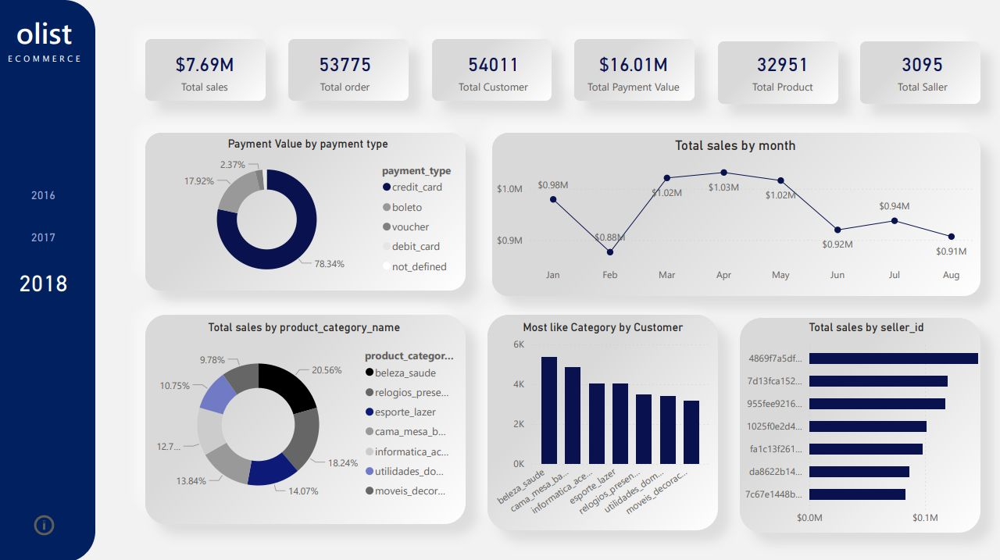
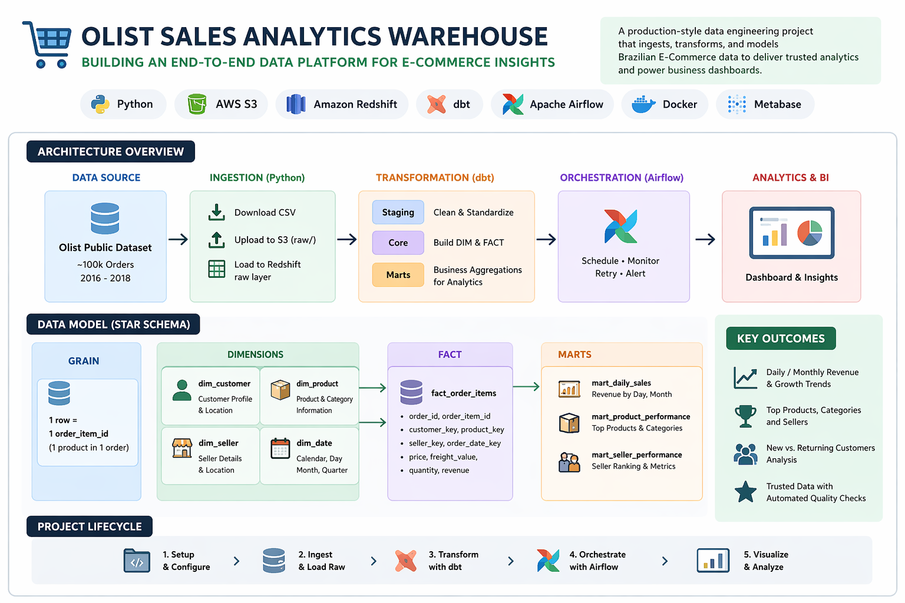
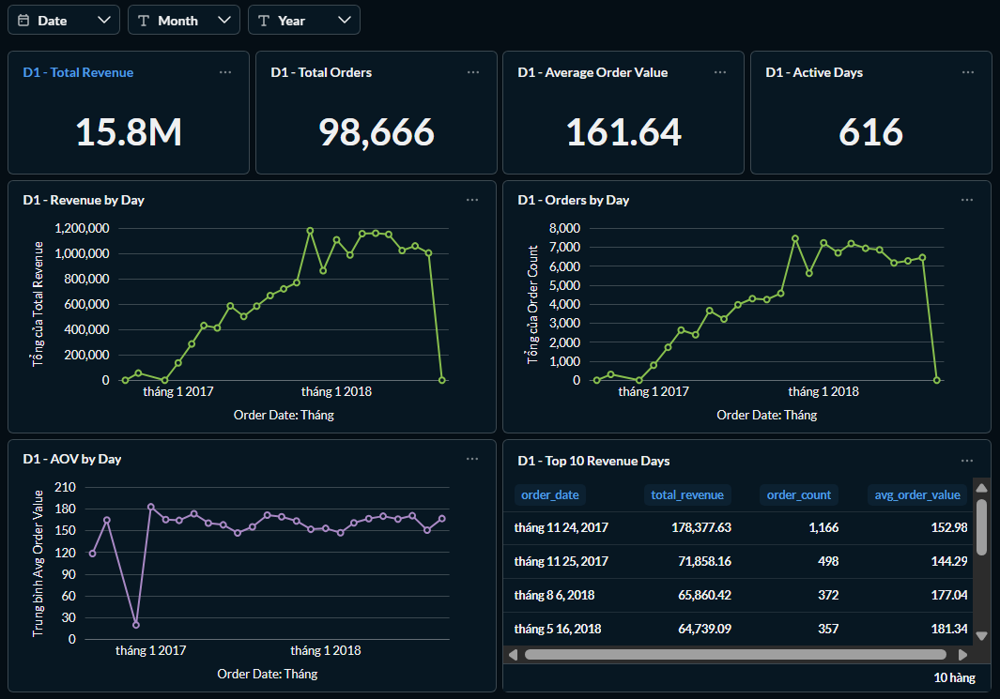
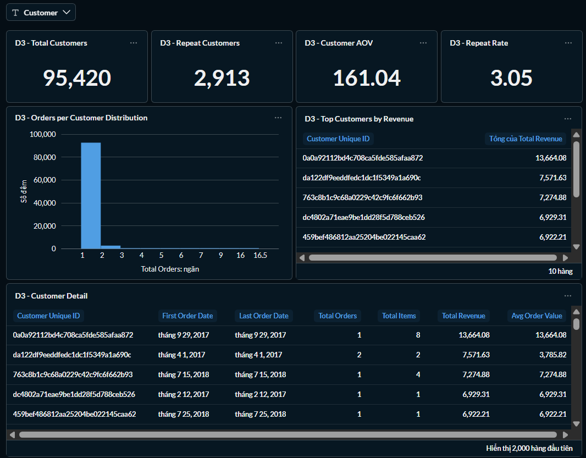
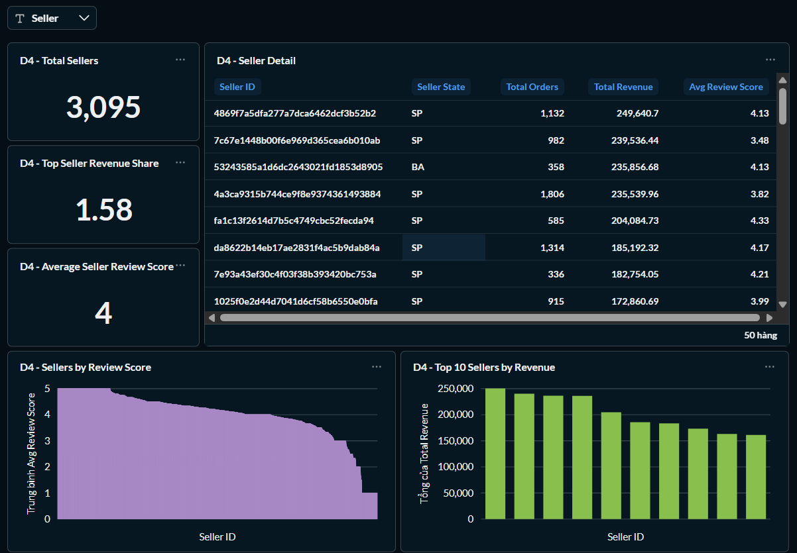

# Olist Sales Analytics Warehouse

## Introduction

End-to-end e-commerce analytics warehouse built with **Python**, **Amazon S3**, **Amazon Redshift**, **dbt**, and **Airflow**.  
The project ingests raw Olist CSV files, models them into a star schema, and serves analytics-ready marts for dashboards.

## What this project does

- Ingest raw e-commerce datasets into an AWS-based warehouse
- Standardize data through `staging -> core -> marts`
- Build reusable dimensions and a line-item sales fact
- Serve trusted datasets for BI and dashboarding

## Architecture

## Data model

**Main fact**
- `fact_order_items`
- Grain: `1 row = 1 order_id + 1 order_item_id`

**Main marts**
- `mart_daily_sales` --> `bi_daily_sales_overview`
- `mart_product_performance` --> `bi_product_performance`
- `mart_customer_360` --> `bi_customer_360`
- `mart_seller_performance` --> `bi_seller_performance`

## Dashboards

**Daily sales overview**

**Product and category performance**

**Customer behavior**

**Seller performance**

## Documentation

- [Architecture](docs/ARCHITECTURE.md)
- [Data model](docs/DATA_MODEL.md)
- [Decision log](docs/DECISION.md)
- [Runbook](docs/RUNBOOK.md)
- [Storytelling](docs/STORYTELLING.md)

## Dataset

Source: **Brazilian E-Commerce Public Dataset by Olist**

## Requirements

This project requires the following tools and services:

- Python 3.11+
- Docker Desktop and Docker Compose
- AWS account
- Amazon S3
- Amazon Redshift Serverless
- dbt Core + dbt-redshift
- Olist CSV dataset
- Environment configuration via `.env` and `profiles.yml`

Optional:
- Apache Airflow for orchestration
- BI tool such as Metabase, Power BI, Tableau, or QuickSight